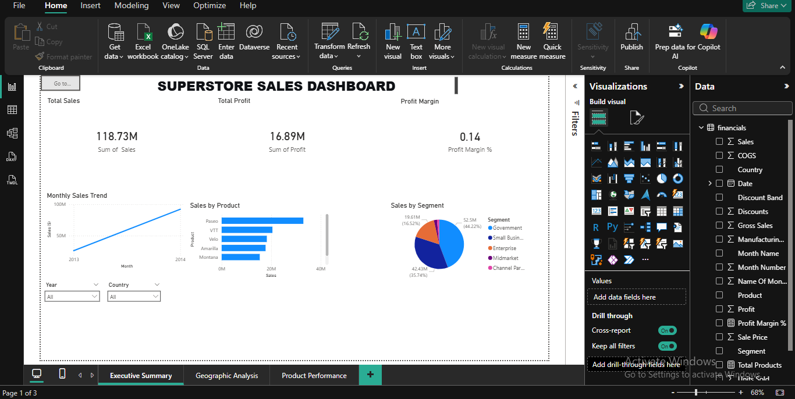
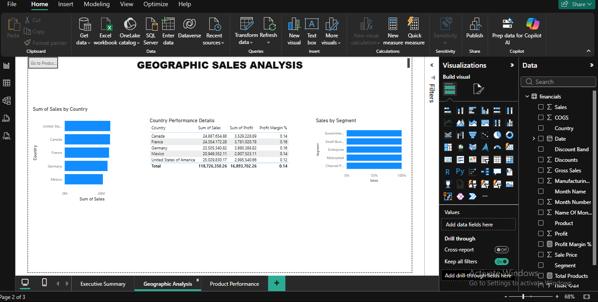
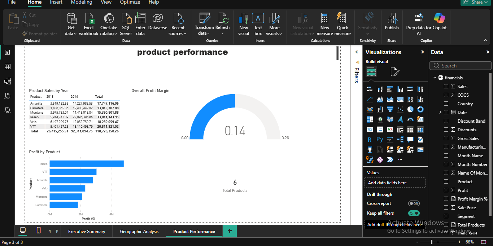

# 📊 Superstore Sales Dashboard - Power BI Project

## 📈 Project Overview
An interactive 3-page Power BI dashboard analyzing $118M in sales data to provide actionable insights for business stakeholders.

## 🔑 Key Features
- **Executive Summary**: KPI cards (Sales, Profit, Margin), monthly trends, product and segment analysis
- **Geographic Analysis**: Sales by country map, country performance tables
- **Product Performance**: Product sales matrix, profit analysis, margin gauge

## 📊 Key Insights
- **Total Sales**: $118.73M
- **Total Profit**: $16.89M
- **Profit Margin**: 14.2%
- **Top Product**: Paseo ($33M in sales)
- **Top Country**: United States and Germany lead in revenue
- **Top Segment**: Government and Small Business have highest margins

## 🛠️ Tools Used
- Power BI Desktop
- DAX (Data Analysis Expressions)
- Power Query for data transformation

## 📁 Files in This Repository
├── `Superstore_Sales_Dashboard.pbix` - Main Power BI dashboard file
├── `README.md` - Project documentation
└── `screenshots/` 
- ## 🚀 How to View This Dashboard
1. Download and install [Power BI Desktop](https://powerbi.microsoft.com/desktop/) (free)
2. Download the `.pbix` file from this repository
3. Open the file in Power BI Desktop
4. Explore the interactive dashboards!

## 📸 Dashboard Preview

**Executive Summary Page:**

**Geographic Analysis Page:**

**Product Performance Page:**

## 📧 Contact
Ayan Yahye - [LinkedIn](https://linkedin.com/in/your-profile) - ayan.yahye@email.com

---

*⭐ If you found this project helpful, please star the repository!*
